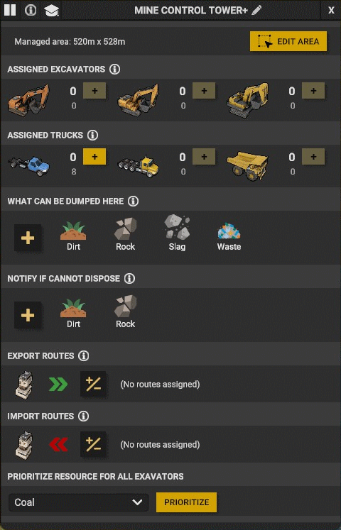
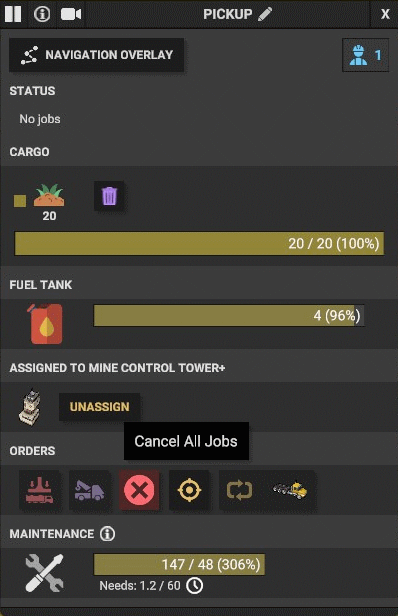
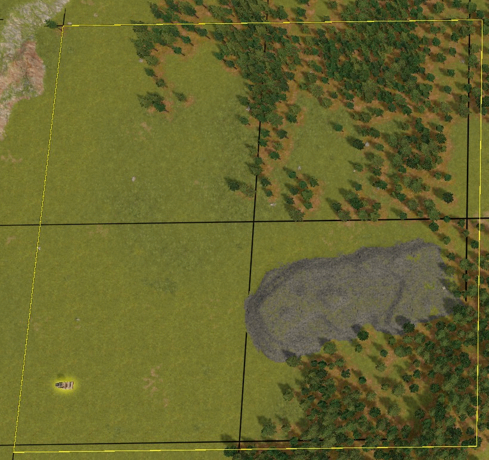

## DoubleQoL Mod

A mod for Captain of Industry game https://www.captain-of-industry.com/.

Quality Of Life Features:

- Add a game speed controller that can speed up the game up to x10.
- Free camera mode with a 6000 max pivot distance
- Enable/disable fog
- Enable/disable building and transports collapse

    

- Add a field in the MineTower view where you can prioritize a specific resource for all excavators
- Add a field in the vehicle view where you can cancel all jobs

    
        

- Change the area size of towers like the MineTower and the ForestryTowe

    
  

## Installation

1. Download the latest zip file from the GitHub Release.
2. Extract the zip file to the `%USERPROFILE%\AppData\Roaming\Captain of Industry\Mods` directory.
3. In the game settings under the Miscellaneous tab toggle Modding button.
4. When you start a new game make sure to select DoubleQoL under "Mods to Include" section or if you're loading an old save make sure to click on Mods in the loading view and select DoubleQoL

  

## Configuration

The zip file include a `DoubleQoL.dll.config` file with it. You can disable/enable any QoL feature or/and change the control key of each one.

1. QoLs Section is where you can enable/disable a QoL.
2. KeyCodes Section is where you can change the KeyCode of each supported QoL.
3. DefaultState Section is where you can set the default state of some QoL when you start the game.

  

## Disclaimers

This mod is primarily designed for personal use, and I am sharing it on GitHub as a courtesy to the community. Please be aware that this mod may not receive regular updates, maintenance, or support. It is provided "as-is," without any warranties or guarantees of functionality, compatibility, or security.

I encourage you to use this mod with caution, and it is your responsibility to ensure its compatibility with your specific software or environment. I am not liable for any issues, damages, or data loss that may occur as a result of using this mod.

If you encounter problems or have questions, feel free to open an issue on this GitHub repository, and I will do my best to assist, but please understand that my availability for support may be limited. You are also welcome to fork, modify, or improve the mod according to your needs.

By using this mod, you agree to the terms outlined in this disclaimer.