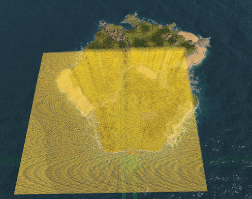

## DoubleQoL

A mod for [Captain of Industry game](https://www.captain-of-industry.com/).

### Features:

- Add a game speed controller that can speed up the game up to x10. [numb8-numb9]
- Free camera mode with a 6000 max pivot distance. [F9]
- Enable or disable fog. [F10]
- Enable or disable building and transports collapse. [keypad9]

    

- Add more info under the statusbar [Right-click on any of the health, unity, or truck icons]

    

- Add a field in the MineTower view where you can prioritize a specific resource for all excavators
- Add a btn in the vehicle view where you can cancel all jobs

    
        

- Change the area size of terrain designations and towers (MineTower and ForestryTower)

     
  
- Add a vehicle tool that can select and move all/specific vehicle

    
  

## Installation

1. Download the latest zip file from the GitHub Release.
2. Extract the zip file to the `%USERPROFILE%\AppData\Roaming\Captain of Industry\Mods` directory.
3. In the game settings, under the Miscellaneous tab, toggle "Modding" button.
4. When you start a new game, make sure to select DoubleQoL under the "Mods to Include" section. If you're loading an old save, be sure to click on "Mods" in the loading view and select DoubleQoL.

## Configuration

The zip file includes a `DoubleQoL.dll.config` file. You can enable/disable any QoL feature and change the control key for each one.

1. The "QoLs" section allows you to enable or disable a QoL.
2. The "KeyCodes" section allows you to change the KeyCode for each supported QoL.
3. The "DefaultState" section lets you set the default state for specific QoL features when you start the game.

  

## Disclaimers

This mod is primarily designed for personal use, and I am sharing it on GitHub as a courtesy to the community. Please be aware that this mod may not receive regular updates, maintenance, or support. It is provided "as-is," without any warranties or guarantees of functionality, compatibility, or security.

I encourage you to use this mod with caution, and it is your responsibility to ensure its compatibility with your specific software or environment. I am not liable for any issues, damages, or data loss that may occur as a result of using this mod.

If you encounter problems or have questions, feel free to open an issue on this GitHub repository, and I will do my best to assist, but please understand that my availability for support may be limited. You are also welcome to fork, modify, or improve the mod according to your needs.

By using this mod, you agree to the terms outlined in this disclaimer.
